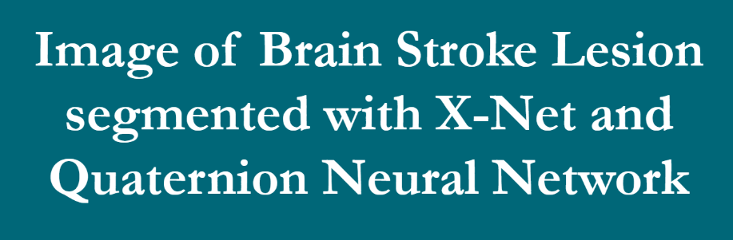
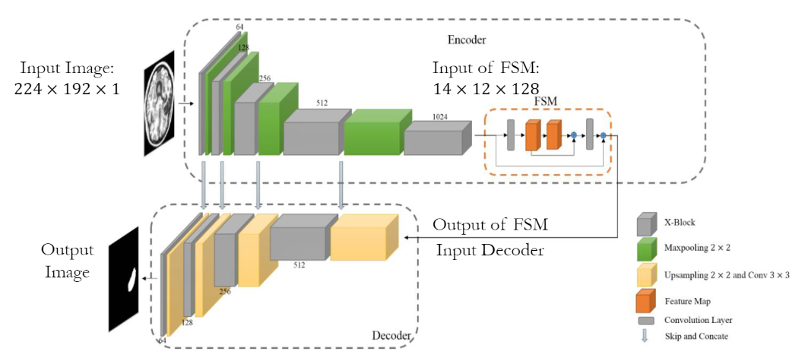
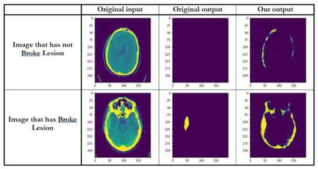
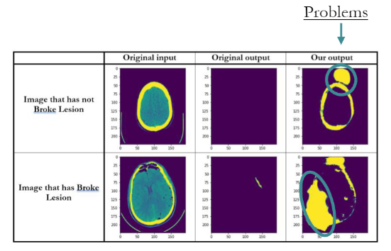
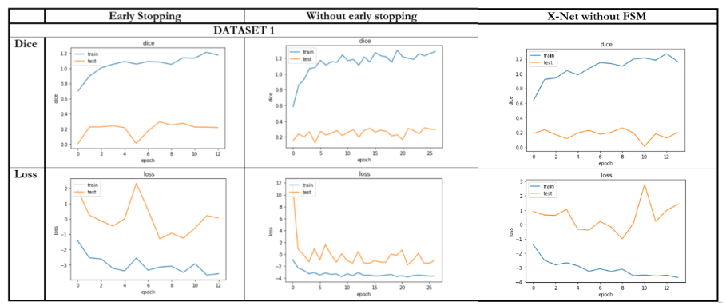

# 2021 NN Final Project

    </img>

Final project for the course of Neural Networks 2020/2021.

>Student: Alessandro Lambertini Mat: `1938390`;
>
>Student: Denise Landini Mat: `1938388`;

## 📝 Assignment

1.	Reimplement the network in the Paper [Link 🔗](https://arxiv.org/abs/1907.07000) (Github page of the paper [Link 🔗](https://github.com/Andrewsher/X-Net))
    -   [NN]X-Net.ipynb [Open In Collab 🔗](https://colab.research.google.com/github/lambertinialessandro/NN-FinalProject/blob/main/[NN]X-Net.ipynb)
2.  Reimplement the same network but in the Quaternion domain.
    -   [NN]X-Net quaternions.ipynb [Open In Collab 🔗](https://colab.research.google.com/github/lambertinialessandro/NN-FinalProject/blob/main/[NN]X-Net%20quaternions.ipynb)

## 💾 Dataset

-   ATLAS [Link 🔗](http://fcon_1000.projects.nitrc.org/indi/retro/atlas.html)

## 📜 Report

-   presentation [Link 🔗](./1938388_1938390%20presentation.pdf)
-   report [Link 🔗](./1938388_1938390%20report.pdf)

    In these files you can read more about the code and the result of the project.

## 💯 Final score:

Score: `30L/30`

## 🙋 Info

for any doubt or clarification contact me on:

-   send me an email at: lambertini.1938390@studenti.uniroma1.it
-   send me a DM on instagram [Link 🔗](https://www.instagram.com/lambertinialessandro/)

## 🎞️ Snapshots

    </img>
     
    X-Net with FSM

    </img>
     
    random sample output from X-Net with FSM

    </img>
     
    random sample output from X-Net without FSM

    </img>
     
    Comparisons between different models

